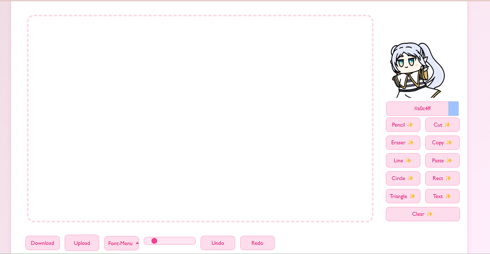

# 🎨 My Awesome Web Canvas 

A web-based drawing canvas app built with **Vanilla JavaScript**.  
Supports drawing, shapes, text input, image upload, undo/redo — except non-responsive UI

🌐 **Live Demo**: [👉 Try it now](https://your-demo-link.com)

## 🖼️ Screenshots

| Drawing Interface |
|-------------------|
|  |

## 🔑 Features

- 🖌️ **Free Drawing**: Pencil & Eraser with adjustable size  
- 📐 **Shapes**: Line, Circle, Rectangle, Triangle  
- 🖊️ **Text Input** with font selector  
- 🖼️ **Image Upload** and Paste  
- 💾 **Download** canvas as PNG  
- ↩️ **Undo / Redo**  
- ♻️ **Clear Canvas** with one click

## 🛠️ Tech Stack

| Tech | Description |
|------|-------------|
|  | **HTML5** |
|  | **CSS3** |
|  | **JavaScript** |
|  | **Firebase** Realtime Database |

## 🤝 Contributing

Contributions are what make the open-source community so special!  
If you have suggestions or improvements:

1. 🍴 Fork this repo  
2. 📥 Create a pull request  
3. 💬 Open an issue with the tag `enhancement`

**Don't forget to ⭐ this repo if you like it!**

## 🚩 Top Contributor

  

## 📄 License

This project is licensed under the GNU General Public License v3.0 - see the [LICENSE](LICENSE.TXT) file for more information.

## 📬 Contact

👦 Lazysoup
📧 noobiestwong@gmail.com

## 🙏 Acknowledgements

- [ChatGPT](https://chat.openai.com/)
- [Best README Template](https://github.com/othneildrew/Best-README-Template)
- [Emojipedia](https://emojipedia.org/)
- [Devicon](https://devicon.dev/)
- [Bootstrap 5](https://getbootstrap.com/docs/5.3/getting-started/introduction/)
- [GPLv3.0](https://choosealicense.com/licenses/gpl-3.0/)
